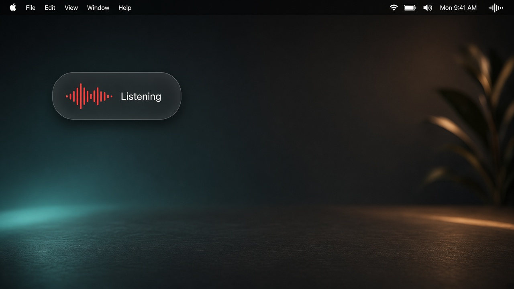
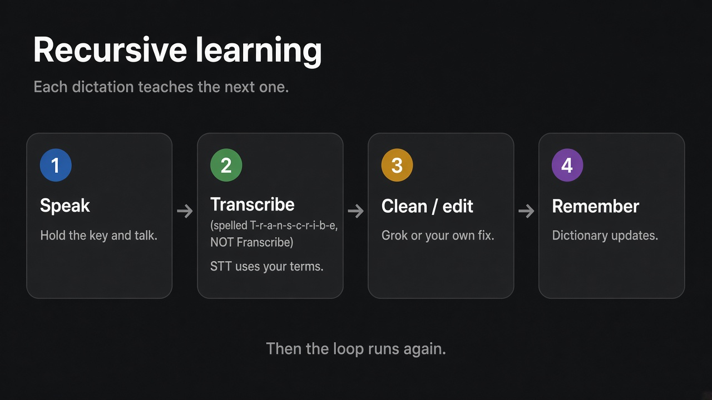
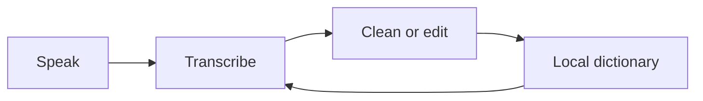

# Quill

**Speak anywhere on your Mac. The text lands where you point.**

<p align="center">
  
</p>

> Public fork: **[diliprt/quill](https://github.com/diliprt/quill)** of [xfreeze2/quill](https://github.com/xfreeze2/quill).  
> Current build: **v0.8.11**. Hold-to-talk, dual-key Grok cleanup, a local dictionary that learns, circle capture, and a start-sound picker.

Tap or hold a key, talk, click the field you want. The words appear there — usually without touching your clipboard.

Transcription uses **your existing Grok subscription**. No extra API key. Nothing metered by Quill.

---

## Recursive learning

The dictionary is a closed loop. Each session can teach the next one, on this Mac only.

<p align="center">
  
</p>

1. **Speak** — hold the smart key (or the simple key for raw STT).
2. **Transcribe** — xAI speech-to-text, biased by terms you already taught it.
3. **Clean / edit** — light Grok cleanup, or a fix you type after paste.
4. **Remember** — unique names land in `~/Library/Application Support/com.freeze.quill/vocabulary.json`. Aliases from cleanup and from your edits feed the next hold as STT keyterms.

Nothing in that file is committed to git. Toggle learning, edit-learning, and keyterms from **Personal dictionary** in the menu. Clear it any time.



---

## What's in this fork (v0.8.11)

| Feature | What it does |
|--------|----------------|
| **Hold to talk** | Press and hold to listen, release to insert. Mic arms on key-down so the first word survives. |
| **Dual keys** | **Simple** — raw STT. **Smart** — STT → Grok cleanup → insert. |
| **Cleanup styles** | Light, detailed for long holds (10s+), or always detailed. |
| **Speculative cleanup** | Starts polishing on the live partial so insert waits less. |
| **Personal dictionary** | Learns unique terms, cleanup pairs, and post-paste edits. Optional STT keyterms. |
| **Nearby text** | Opt-in: focused field / title / selection (never passwords) to help spell names. |
| **Circle capture** | Opt-in: circle a region while talking; screenshot stays on the clipboard. |
| **Start sound** | Menu-bar section: Off, Tink, Pop, Purr, Glass, Ping, Bottle. |
| **Idle pill** | Optional corner button if you'd rather click than hold. |

Typical layout (change it in **Trigger**):

- Gesture: **Hold to talk**
- Simple: **Right ⌥** or **Right ⌘**
- Cleaned: **🌐** or the other dedicated key
- Leave **Control** free for Grok Build (`⌃M`, `⌃O`, …)

---

## Use it

1. Hold your trigger. The corner bar listens.
2. Talk. The transcript streams live.
3. Finish however you like:
   - **release the key** (hold-to-talk)
   - **stop talking** (adjustable pause, default 5s)
   - say **"that's it"** / **"that's all"** (the phrase is stripped)
   - **click** the destination field
   - tap the trigger again
   - **Escape** discards

Highlight text first to replace it. The selection is captured when you press the key.

The idle pill is clickable too. Drag it to an edge and it stays there.

### “Open Grok” while talking

Say **open Grok** or **open Grok Build** mid-sentence. Quill opens a Grok Build session and keeps recording. The command phrase is removed from the insert (including common mishearings like “grog” / “grock”).

---

## Settings

Right-click the menu-bar waveform (or the pill):

- **Start / Stop dictation**
- **Start sound** — Off plus six system ticks
- **Clean up with Grok** — enable the smart key, nearby context, speculative cleanup, eager insert, cleanup style
- **Personal dictionary** — learn while dictating, learn from edits, STT keyterms, add / remove terms
- **Appearance** — idle pill, circle capture, reset panel
- **Trigger** — key + hold / single / double
- **Finish when I stop talking**
- **Language** — 26 languages or auto
- **Recent** — last 20 transcripts (optional, local)
- **Start at login**

---

## Install this fork

```sh
git clone https://github.com/diliprt/quill.git && cd quill
./signing/install-identity.sh   # once per machine
./build.sh                      # ~/Applications/Quill.app
open -a Quill
```

Upstream zip / curl install is stock Quill without these extras. Prefer building this repo if you want hold-to-talk, cleanup, and the dictionary.

---

## What you need

| | |
|---|---|
| **macOS 12+** | Universal — Apple Silicon and Intel |
| **A Grok subscription** | Uses the login the `grok` CLI already stores |
| **Microphone** | Asked on first use |
| **Accessibility** | Trigger key + typing into other apps |
| **Screen Recording** | Only if you turn on circle capture |

If the keyboard does nothing and only the pill works, that is Accessibility. The pill turns **amber** — click it.

---

## How the text gets in

Quill prefers Accessibility: focused field, caret to the end, write the text. Terminals and many web views fall back to a synthetic ⌘V, then restore your clipboard.

---

## Privacy

- Audio goes to xAI speech-to-text. Cleanup (smart key only) goes to xAI chat.
- The Grok token is read from `~/.grok/auth.json` per recording. Quill does not copy it into the repo or into logs.
- The personal dictionary and optional recent transcripts stay on this Mac.
- Nearby-context never sends password fields.
- `~/Library/Logs/Quill.log` records what happened (app name, timings) — not keystrokes.

---

## Build notes

No Xcode project. `build.sh` compiles `Sources/*.swift` and signs with a local **Quill Local Signing** identity so Accessibility / Microphone grants survive rebuilds.

```sh
# Track upstream
git remote add upstream https://github.com/xfreeze2/quill.git   # if missing
git fetch upstream
git merge upstream/main
./build.sh
```

Cleanup model in this fork: `grok-4-1-fast-non-reasoning` (xAI maps that to a fast non-reasoning Grok). Length-scaled timeout, then paste **raw**. Single model, no fallback chain.

---

## Known limits

- Settings are per-machine.
- A recording stops after 5 minutes, or after 10 seconds of silence with no transcript.
- Not notarised — locally built apps skip quarantine; downloaded zips need `xattr -dr com.apple.quarantine`.

---

## Licence

MIT. Use it for anything. Upstream: [xfreeze2/quill](https://github.com/xfreeze2/quill).
